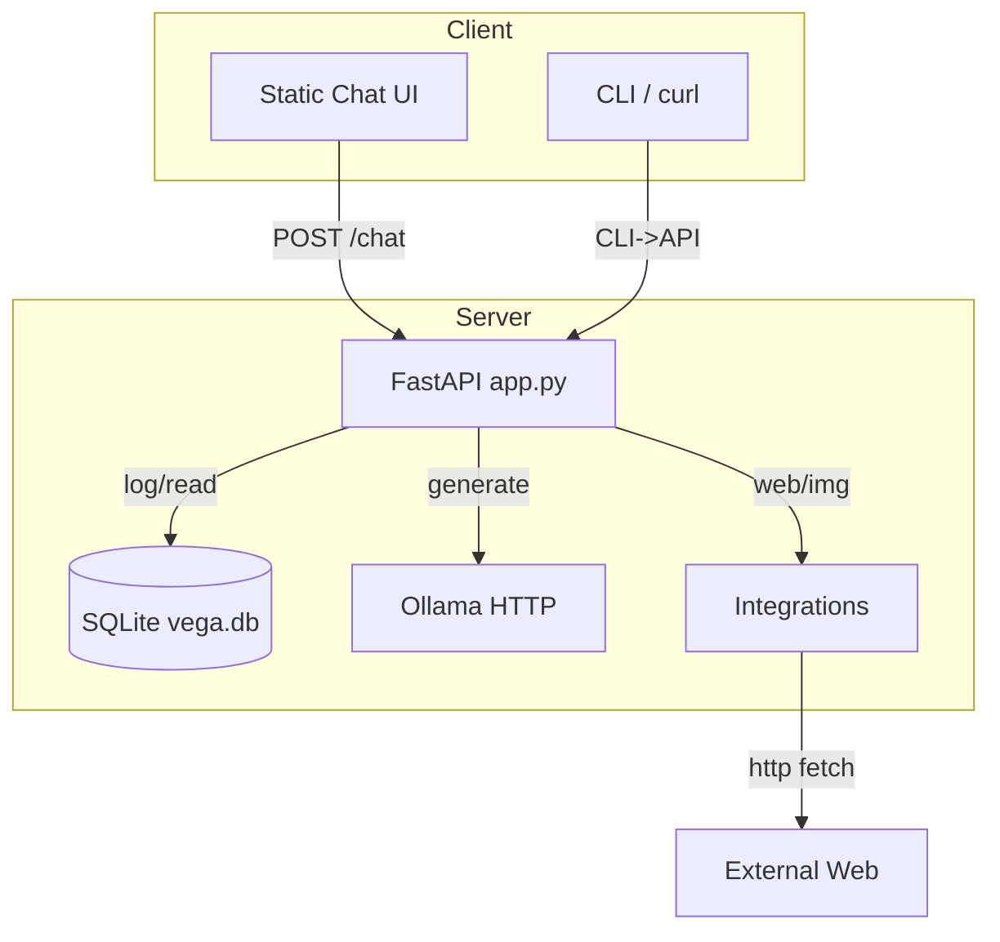

# Architecture

This document explains Vega2.0's system design, key components, and data flows.

[Back to Docs Hub](README.md)

## Overview

Vega2.0 is a local-first LLM service and CLI built around FastAPI, SQLite, and an Ollama backend. It provides endpoints for chatting, research (web search + summarize), OSINT helpers, and basic admin controls. Conversations are persisted to a local SQLite database. Optional rate limiting and resiliency features (circuit breaker, TTL cache) are included.

## Components

- FastAPI app (app.py): HTTP API, endpoints, request/response lifecycle, metrics
- LLM integration (llm.py): Async client for Ollama; circuit breaker + TTL cache
- Database (db.py): SQLAlchemy models and helpers for SQLite (vega.db)
- Integrations (integrations/*.py): web/image search, HTML fetch, OSINT utilities, Slack webhook
- Datasets & Training (datasets/*, training/*, learning/*): dataset builders, eval/curation, HF training
- CLI (cli.py): mirrors API functionality via Typer + Rich
- Config (config.py): environment loading and validation
- Resilience (resilience.py): CircuitBreaker and TTLCache
- Security (security.py): PII masking utilities
- Static UI (static/index.html): simple browser client for the API
- Systemd unit (systemd/vega.service): service management on Linux

## High-level Diagram

## Request Lifecycle (Chat)

1. Client calls POST /chat with JSON body {prompt, stream=false, session_id?} and X-API-Key.
2. app.py validates API key, size checks, and optional short-term memory augmentation (recent session messages).
3. llm.query_llm() dispatches to the configured backend (Ollama). Circuit breaker and caching are applied.
4. Response is truncated to max_response_chars and returned.
5. db.log_conversation() persists prompt/response and metadata.

Streaming path uses /chat/sse with Server-Sent Events (SSE) wrapping token stream.

## Resiliency

- CircuitBreaker: opens after N consecutive failures for T seconds; prevents hammering the backend.
- TTLCache: caches full-string generations for identical prompts for a short TTL.
- Startup probe: background task probes Ollama; /metrics reflects degraded status.
- Timeouts and retries: controlled via environment/config.

## Data Model

Table conversations:

 id INTEGER PK AUTOINCREMENT
 ts DATETIME DEFAULT utcnow
 prompt TEXT
 response TEXT
 source VARCHAR(32) (api|cli|integration)
 session_id VARCHAR(64) NULL
 rating INTEGER NULL
 tags TEXT NULL
 notes TEXT NULL
 reviewed INTEGER DEFAULT 0

Indexes:

 ix_conv_ts (ts DESC)
 ix_conv_session (session_id, id DESC)

## Security Model

- All non-health endpoints require X-API-Key matching config.API_KEY or a configured extra key.
- PII masking optional: mask emails/phones/secrets on write.
- Keep HOST=127.0.0.1 to bind locally and avoid exposure; use a reverse proxy for remote access with auth if needed.
- Optional rate limiting with slowapi if installed.

## Extensibility

- Backends: llm.py is structured to add an HF backend (query_hf) and dispatch based on LLM_BACKEND.
- Integrations: new modules can be added under integrations/ and wired to API/CLI.
- Datasets: loaders can be extended for new formats; training pipeline can be customized.

